

  

 <h1 align="center">CUET Virtual Classroom</h2>
 
CUET Virtual Classroom is an online web application made as the Lab project for CSE 300: Software Development Project.

  

    
    
    
    
     
  <h3 align="center">Built With</h3>
  <h4 align="center">Frameworks and Dependencies</h4>
  

  
    
    </a>
    
    

## Team Members:
* Adiba Sultana- 1804046
* Nafis Fuad Pranta- 1804053
* Ashfaqur Rahman Adib- 1804055
* Tahlil Abrar- 1804056
* Zerin Shaima Meem- 1804057

# Features
- [Signin](#signin)
- [Dashboard](#dashboard)
- [Notifications](#notifications)
- [Sidebar](#sidebar)
- [Calendar](#calendar)
- [Profile](#profile)
- [Edit Profile](#edit-profile)
- [Create Course](#create-course)
- [Publish Result](#publish-result)
- [Attendance](#attendance])
- [Display Result](#display-result)
- [Join Class](#join-class)
- [Class List](#class-list)
- [View Inside Classroom](#view-classroom)
- [Upload Post](#upload-post)
- [Comment](#comment)

## Signin
Users can create a new account by registering with an email.
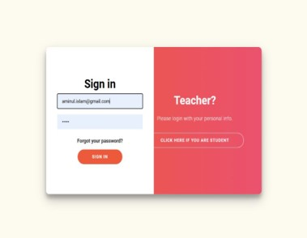 | 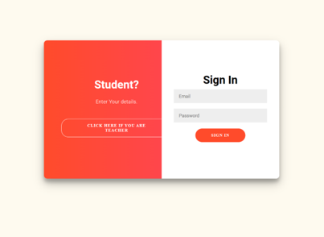

## Dashboard
Users can create a new account by registering with an email.
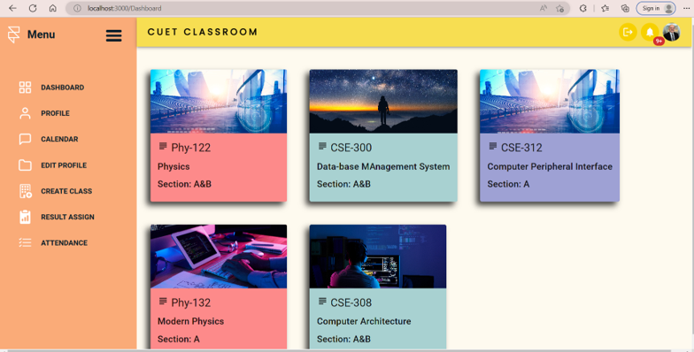

## Notifications
Users can create a new account by registering with an email.
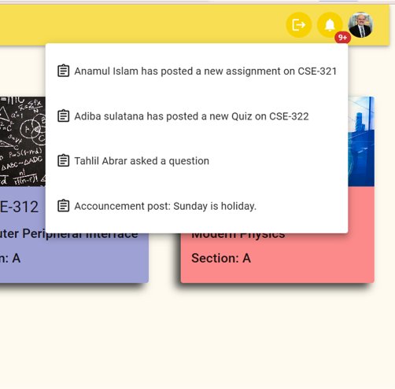

## Sidebar
Users can create a new account by registering with an email.
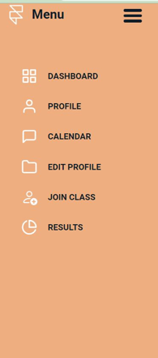

## Calendar
Users can create a new account by registering with an email.
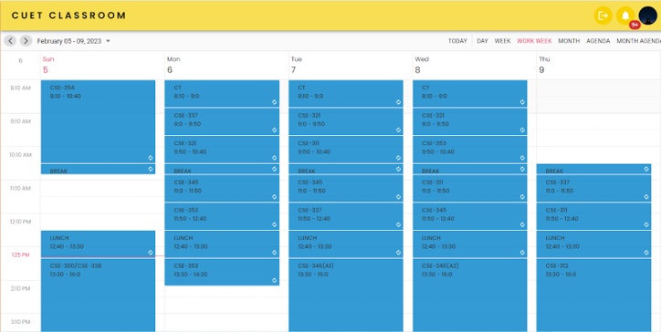

## Profile
Users can create a new account by registering with an email.
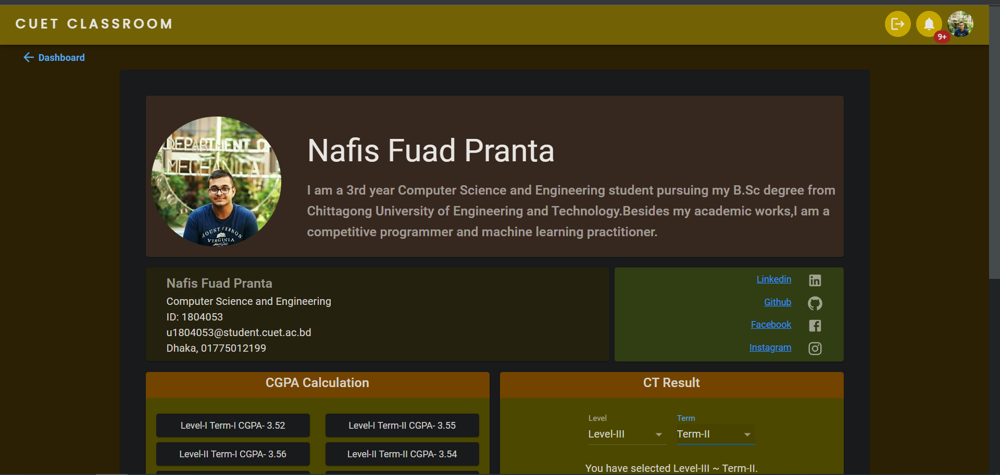

## Edit Profile
Users can create a new account by registering with an email.
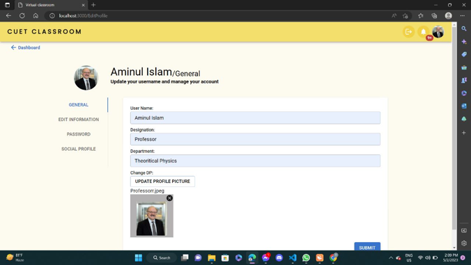

## Create Course
Users can create a new account by registering with an email.
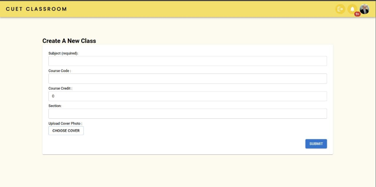

## Publish Result
Users can create a new account by registering with an email.
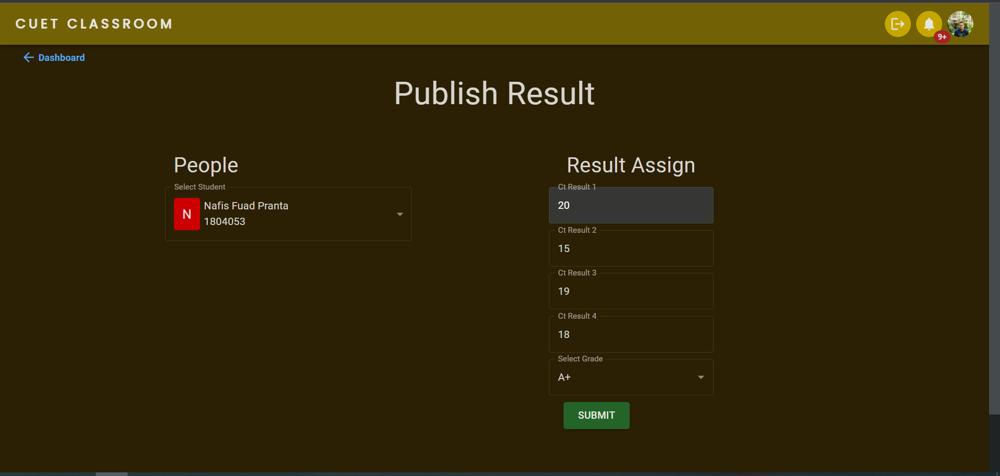

## Attendance
Users can create a new account by registering with an email.
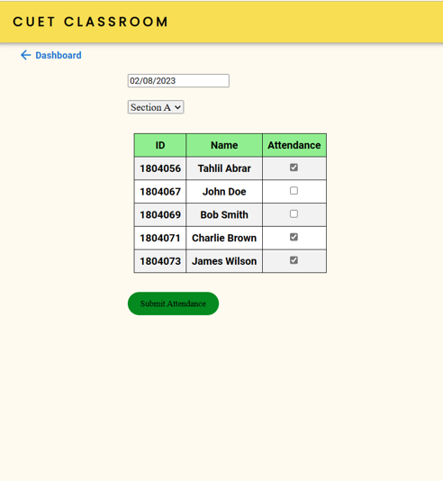

## Display Result
Users can create a new account by registering with an email.
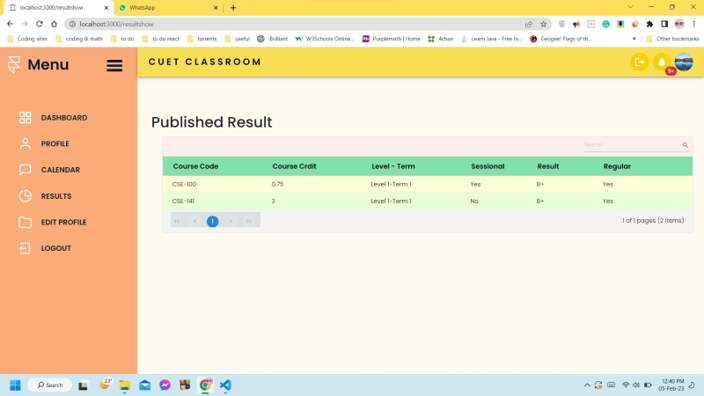

## Join Class
Users can create a new account by registering with an email.
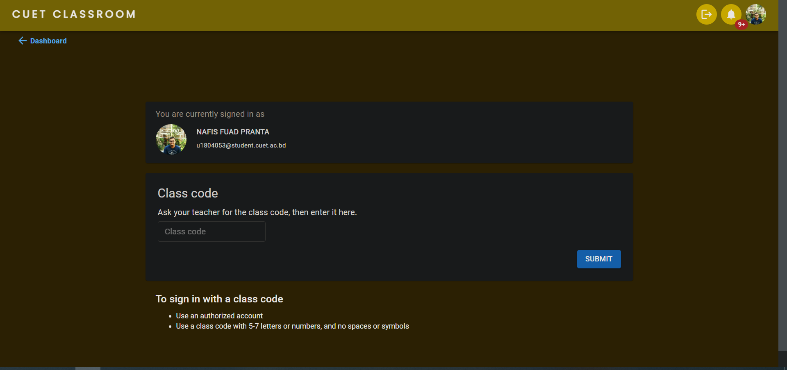

## Class List
Users can create a new account by registering with an email.
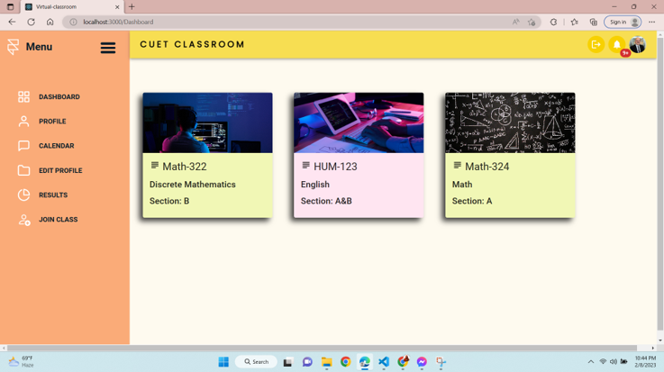

## View Inside Classroom
Users can create a new account by registering with an email.
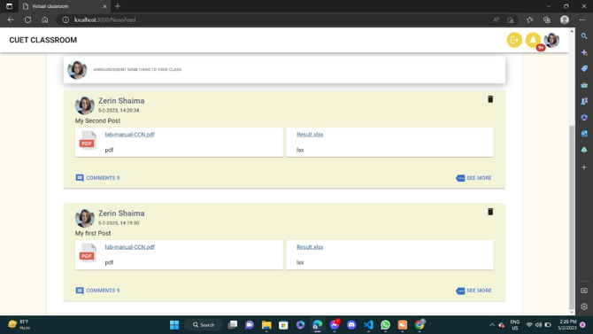

## Upload Post
Users can create a new account by registering with an email.
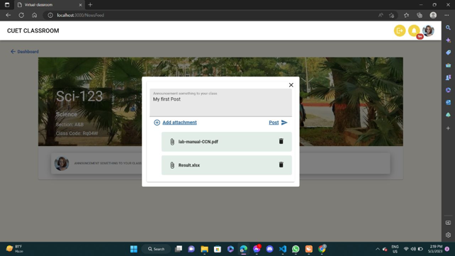

## Comment
Users can create a new account by registering with an email.
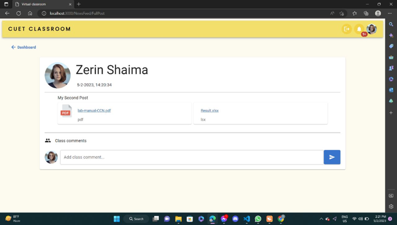

## Resources:
### Tutorials:
* [Basic React Tutorial by Learn with Sumit-LWS-Bangladesh](https://www.youtube.com/watch?v=5Xy-t8k_M4A&list=PLHiZ4m8vCp9M6HVQv7a36cp8LKzyHIePr)
* [Basic Django Tutorial by Corey Schafer](https://www.youtube.com/playlist?list=PL-osiE80TeTtoQCKZ03TU5fNfx2UY6U4p)
* [Firebase Tutorial by freeCodeCamp.org](https://www.youtube.com/watch?v=fgdpvwEWJ9M)

